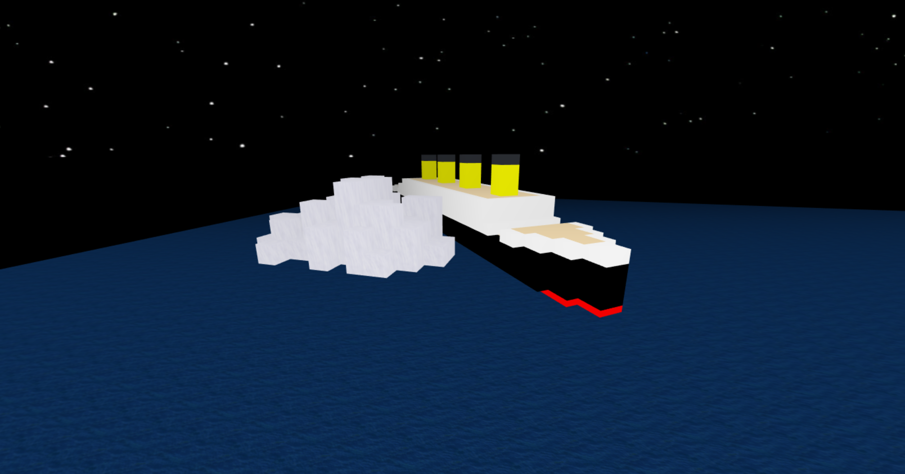
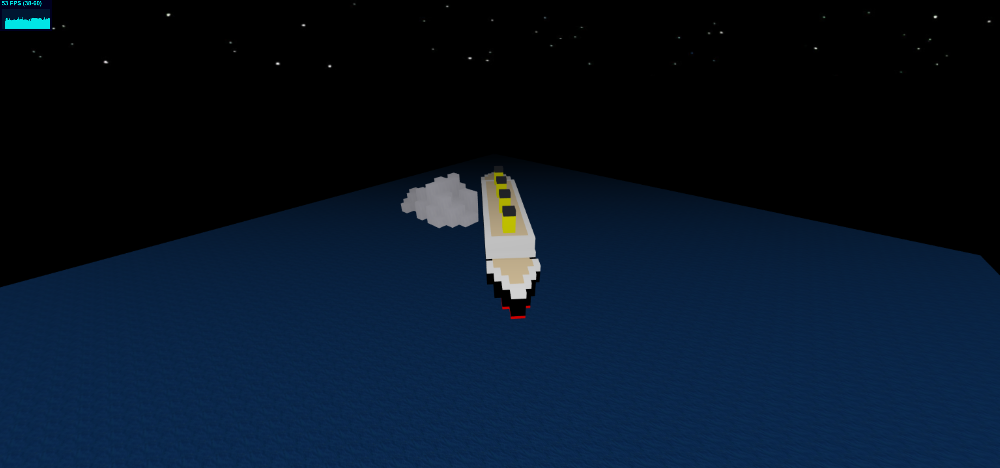
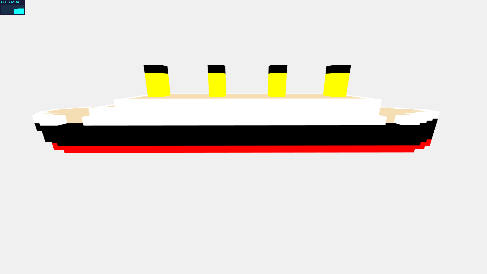
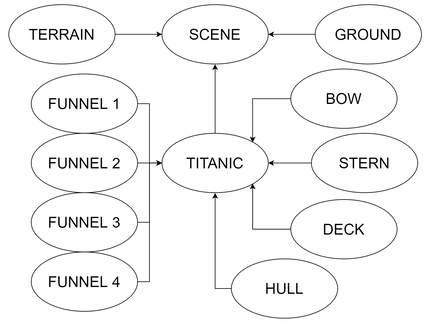
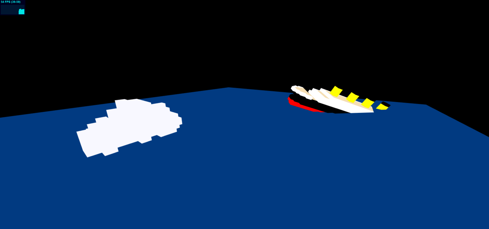

# Cubes

Progetto per il corso di Interactive 3D Graphics dell'Università di Udine (2019).

La consegna prevede la progettazione e creazione di una scena composta solo da box cubici (almeno 30) traslati, ridimensionati e ruotati a piacimento. La scena deve essere provvista di un'animazione semplice ma significativa che può riprodursi in modo continuo. Il terreno dell'ambientazione va creato utilizzando come input una heightmap sotto forma di immagine in scala di grigi.

## Descrizione

La scena rappresentata in questo progetto è una ricostruzione semplificata del celebre incidente avvenuto nella notte tra il 14 e il 15 aprile 1912 che ha portato al naufragio del leggendario transatlantico RMS Titanic. La nave, un capolavoro ingegneristico dell'epoca, era la più grande e lussuosa al mondo ma, nonostante fosse considerata pressoché inaffondabile, naufragò nell'oceano Atlantico a causa dell'impatto con un iceberg proprio durante il suo viaggio inaugurale.

Il Titanic colpì di striscio la massa di ghiaccio con la parte destra della prua, aprendo una falla nello scafo. Iniziò quindi ad immagazzinare acqua, sprofondando inesorabilmente. La parte anteriore venne velocemente sommersa, causando il sollevamento della poppa verso l'alto fino a formare un angolo di circa 30 gradi con il mare. A quel punto la nave si spezzò in due tronconi per poi inabissarsi rapidamente. Molto probabilmente, però, il Titanic si divise sotto la superficie dell'acqua: i testimoni oculari raccontarono infatti di aver visto il transatlantico affondare tutto intero, pertanto è questa la situazione che viene rappresentata nella ricostruzione di questo progetto.

L'incidente ebbe un impatto mediatico enorme: il Titanic era la nave più famosa dell'epoca e la notizia del suo naufragio fece il giro del mondo. Poiché molto intensa, drammatica e ricca di episodi particolari, la storia del transatlantico divenne negli anni oggetto di numerose opere come libri, canzoni e soprattutto film (il più popolare è il colossal del 1997 di James Cameron, vincitore di 11 Oscar) che ne hanno alimentato la leggenda, rendendo il Titanic un'icona eterna.

## File e cartelle

* **`lib`**: contiene le librerie necessarie al funzionamento del progetto.
* **`parts`**: contiene le classi Javascript per la costruzione del Titanic e del terrain.
  * `bow.js`: classe per la creazione della prua del Titanic.
  * `deck.js`: classe per la creazione del ponte della nave.
  * `funnel.js`: classe per la creazione dei fumaioli.
  * `hull.js`: classe per la creazione dello scafo.
  * `stern.js`: classe per la creazione della poppa della nave.
  * `terrain.js`: classe per la creazione del terreno.
* **`pics`**: contiene le immagini inserite in questo file e nel `journal.md`.
* **`textures`**: contiene le textures utilizzate nella scena e la heightmap usata per la creazione del terreno.
  * `heightmap.png`: la heightmap in scala di grigi.
  * `ice.jpg`: texture per l'iceberg da Spiral Graphics (sito non più esistente).
  * `sea.png`: texture per l'oceano da [3DJungle](https://3djungle.net/textures/water/1832/) scurita con Microsoft Office PowerPoint.
  * `sky.jpg`: texture utilizzata in background per simulare il cielo notturno (da [PublicDomainPictures.net](https://www.publicdomainpictures.net/en/view-image.php?image=9767&picture=starry-night)).
* `index.html`: file principale che contiene il codice del progetto.
* `journal.md`: file che contiene il processo di sviluppo del progetto: qui vengono segnalati i progressi giornalieri e le scelte effettuate.
* `README.md`: questo file.

## Risultati

La scena rappresentata contiene il Titanic e il terreno che comprende l'iceberg e la porzione di oceano in cui si svolge la ricostruzione. Per simulare meglio la grande oscurità che fu tra le cause dell'incidente (era una notte di Luna nuova e il buio impedì alle vedette di avvistare in tempo l'iceberg), sono stati aggiunti un ground completamente nero attorno al terreno e una nebbia anch'essa nera. Come da consegna, nave e terreno sono formati da box opportunamente scalati, traslati e ruotati. Il terreno è ottenuto a partire da una heightmap 60x60 in scala di grigi.

La scena racchiude in pochi secondi il naufragio dall'impatto alla completa immersione della nave. Le animazioni sono suddivise in 6 fasi:
- all'inizio il Titanic sta virando disperatamente nel tentativo di schivare l'iceberg ma non riesce ad evitare la collisione
- poi il transatlantico continua la sua corsa rallentando e affondando lentamente
- in seguito la nave si ferma e la prua inizia a sprofondare nell'oceano dalla parte in cui è stata aperta la falla
- la prua viene sommersa velocemente e la poppa si staglia sempre più verso il cielo
- raggiunto un angolo di 30 gradi col mare, il Titanic affonda negli abissi
- la nave viene riportata nella posizione iniziale e la scena riparte.

La camera osserva lo scenario seguendo i movimenti del Titanic. L'osservatore è libero di spostarla con il mouse in tutte le direzioni ma non sotto il livello del mare, mantenendo comunque l'obiettivo puntato sul transatlantico.

Nelle prove di esecuzione del progetto finale il frame rate è stato di 50-60 fps e durante gli spostamenti manuali della camera poteva scendere a 45 fps.
Tutte le prove sono state effettuate con un notebook ASUS VivoBook Pro 15 N580VD-FI523T con le seguenti caratteristiche:
- processore Intel Core i7-7700hq (2.8 ghz)
- GPU NVIDIA GeForce GTX 1050
- sistema operativo Windows 10 Home
- browser Google Chrome versione 74.0.3729.169 (Build ufficiale) (a 64 bit)

## Processo di sviluppo

Dopo aver preso la decisione di rappresentare l'incidente del Titanic, il primo passo è stato quello di ricercare materiale online da cui prendere ispirazione per ricreare la nave e la scena. Lo step successivo è stato quello di disegnare il progetto del transatlantico su carta per poi provare a crearlo in Three.js. Dopo alcuni tentativi, il disegno del progetto definitivo è stato portato a termine.

|  |
| :--------------------------------------------: |
| Disegno del progetto definitivo del Titanic |

Il Titanic è stato creato suddividendolo in 5 parti per semplificarne il codice e la costruzione: scafo, ponte, fumaioli, prua e poppa. Per ognuna di esse è stata creata una classe.

|  |
| :-----------------------------------------: |
| Titanic completo |

Terminata la nave, l'attenzione si è spostata sulla creazione del terreno: l'idea è stata quella di creare l'iceberg e la porzione di oceano interessata dall'incidente tramite le funzioni fornite e una heightmap.

|  |
| :----------------------------------: |
| Heightmap 60x60 |

La creazione del terreno è stata affidata ad una classe apposita che sfrutta la funzione *getHeightData* per generare il mare e l'iceberg a partire dalla heightmap.

|  |
| :------------------------------------: |
| Iceberg e porzione di oceano creati tramite la heightmap |

Il passo successivo è stato quello di dedicarsi alle animazioni per ricreare l'incidente. Il grafo della scena è abbastanza semplice: oltre al ground (che è stato aggiunto in seguito), sono presenti il terreno e il Titanic. Quest'ultimo è l'unico oggetto interessato alle animazioni ed è a sua volta composto da scafo (HULL), ponte (DECK), prua (BOW), poppa (STERN) e dai fumaioli (FUNNEL) che sono quattro oggetti identici ottenuti tramite clonazione del primo elemento. La nave si comporta comunque come un singolo corpo rigido durante tutte le animazioni.

|  |
| :----------------------------------: |
| Grafo della scena |

Le varie fasi dell'incidente ricostruite tramite le animazioni sono descritte nella sezione precedente.

|  |
| :-------------------------: |
| Prime prove di animazioni del naufragio |

In seguito è stata modificata la camera e sono stati aggiunti il ground e la nebbia per dare un maggiore senso di oscurità alla scena. Sono poi state inserite le texture per il mare (leggermente modificata), l'iceberg e il cielo in background. Tutte le texture sono state utilizzate rispettando le relative licenze.

### Strumenti

* **Atom**: editor per il coding e la gestione della repository.
* **Microsoft Paint**: utilizzato per la creazione della heightmap in scala di grigi.
* **Microsoft Office PowerPoint**: utilizzato per scurire la texture dell'oceano.
* **iLoveIMG**: app online utilizzata per ridimensionare alcune immagini e texture.